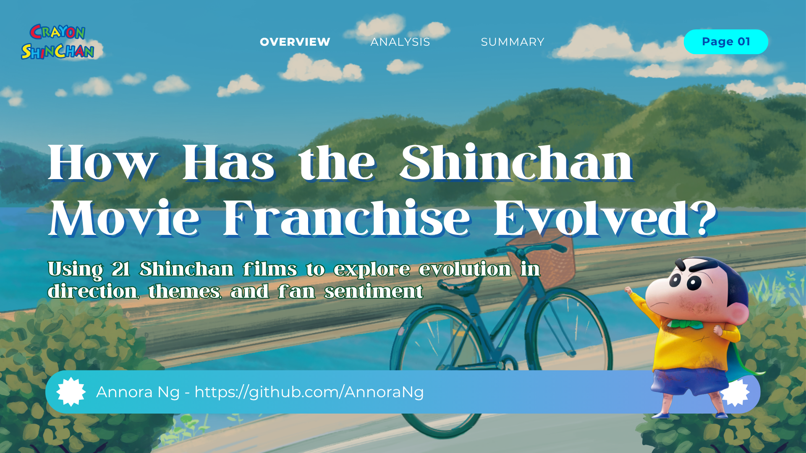
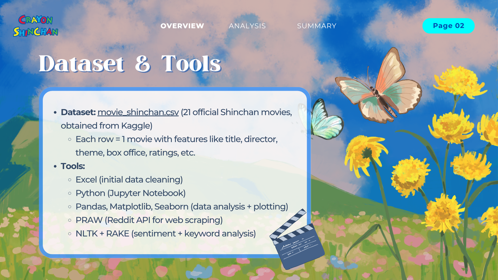
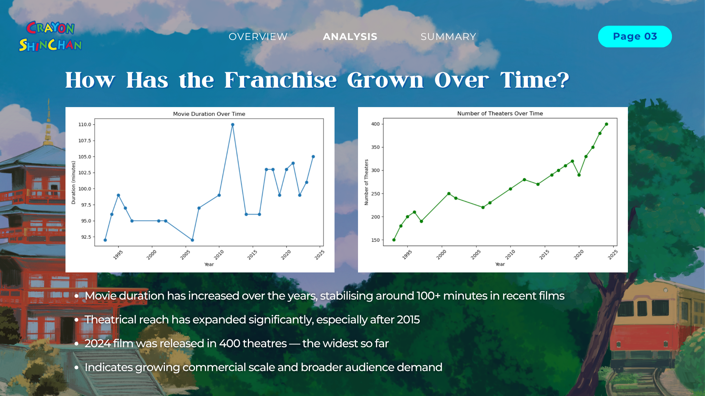
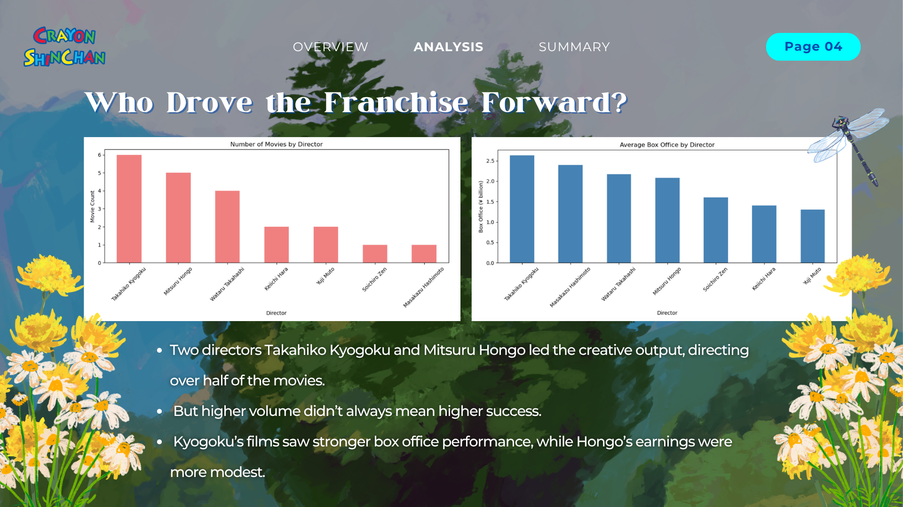
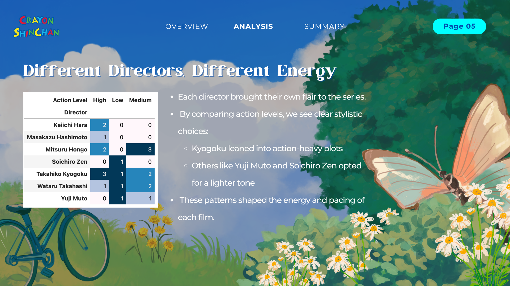
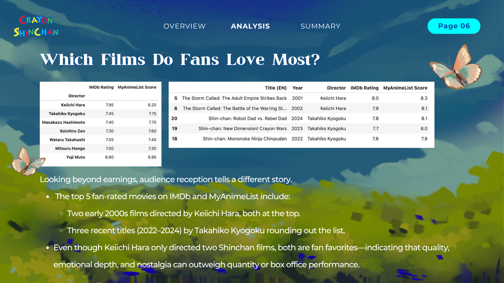
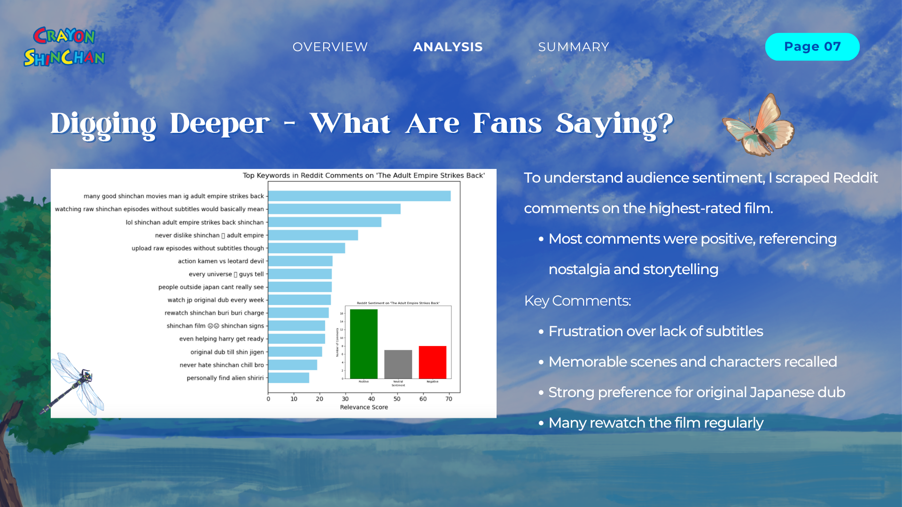
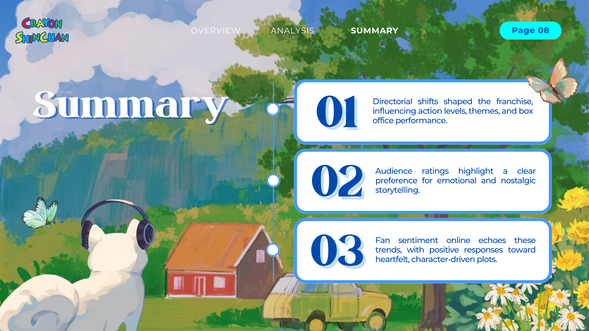
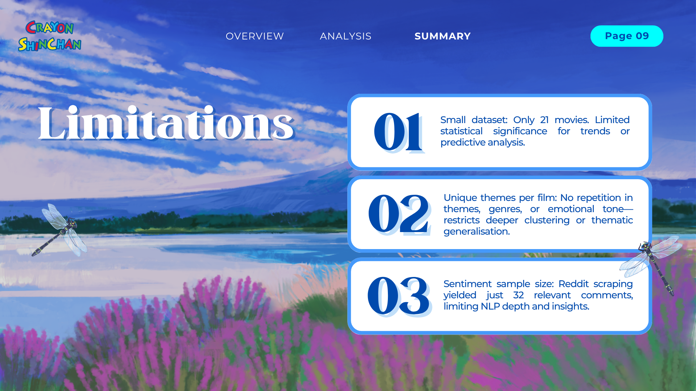

# 📽️ Shin Chan Movie Franchise: A Data Story

This project explores how the Crayon Shin-chan movie franchise has evolved over time, based on data from 21 official films. From directors and action levels to box office performance and fan sentiment, the goal was to uncover patterns in how the series grew while maintaining its identity.

---

## 🔍 Dataset

**Source:** [Kaggle – Shinchan Complete Dataset](https://www.kaggle.com/datasets/samasiayushman/shinchan-complete-dataset)  
**File used:** `movie_shinchan.csv`

---

## 📌 Key Questions Explored

- How has the franchise grown over time?  
- Do different directors influence box office and action level?  
- Which movies are rated highest by fans?  
- What are fans saying about the most loved film?

---

## 🛠️ Tools Used

- **Python** (`pandas`, `matplotlib`, `seaborn`, `nltk`, `rake-nltk`)  
- **Excel** (initial review and cleaning)  
- **Web scraping** (Reddit comments via `praw`)  
- **Jupyter Notebook** for analysis and visualisation  
- **Canva** for final PDF slide deck

---

## 📈 Summary of Findings

- **Movie evolution**: Duration and theatre count increased gradually over time  
- **Directors**: Keiichi Hara directed two of the top-rated movies despite not being the most frequent director  
- **Ratings**: IMDb and MyAnimeList align on the top 5 films  
- **Fan sentiment**: Reddit comments on *The Adult Empire Strikes Back* showed strong nostalgia and ongoing rewatch value  

---

## ⚠️ Limitations

- Dataset is limited to 21 movies, restricting statistical depth  
- Only 32 Reddit comments scraped for sentiment—insightful but surface-level  
- Thematic columns (e.g. adventure type, emotional focus) had no repeat values, limiting clustering or grouping

---

## 📂 Files

| File | Description |
|------|-------------|
| `Shin Chan Universe.ipynb` | Main notebook with code, visualisations, sentiment and keyword analysis |
| `movie_shinchan.csv` | Raw movie dataset used in this analysis |
| `reddit_comments_shinchan_adult_empire.csv` | Reddit comments scraped for sentiment and keyword analysis |
| `Shin Chan Analysis_compressed.pdf` | Final slide deck summarising the project |

---

## 🙌 Acknowledgements

- Dataset by [@samasiayushman](https://www.kaggle.com/datasets/samasiayushman)  
- Reddit data retrieved using the `praw` API

### 🌸 Visual Walkthrough: The Story Behind the Data

Explore the Shinchan movie data through this visual narrative. Each slide highlights a different angle of the analysis.

**1. Project Cover Slide**  

**2. Dataset and Tools Used**  

**3. How Has the Franchise Grown Over Time?**  

**4. Who Drove the Franchise Forward?**  

**5. Different Directors, Different Energy**  

**6. Which Films Do Fans Love Most?**  

**7. Digging Deeper – What Are Fans Saying?**  

**8. Summary of Insights**  

**9. Limitations**  

**10. Thank You Slide**  

